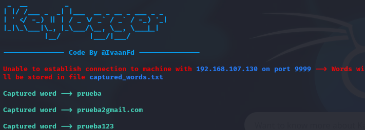
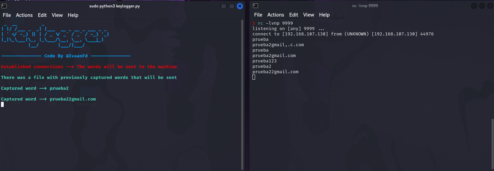

# Keylogger

Python script that performs a scan of open ports on a specific IP address

Permissions must be given or the script must be run as sudo for it to work properly

Firstly it performs a quick scan of the open ports on the target IP, secondly, if there are any open ports the script displays a command to perform a deeper analysis of the open ports only

# Necessary dependences

* Pyfiglet: pip install pyfiglet
* Keyborad: pip install keyboard

# Execution

After execution, the program attempts to connect to the IP address on the specified port. If the connection is successfully established, each time the "space" key is pressed, it is interpreted as the formation of a word, and this is sent through the socket. In case the connection has not been established, the words are recorded in a file. When the connection to the other machine is re-established, the entire contents of the file are sent.

- Whiout established connection:

* Whit established connection:

